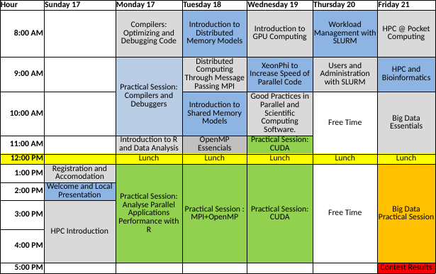

## Program

### Overview

### Sunday 16

- Registration and Accomodation
- Welcome and Local Presentation
- HPC Introduction

### Monday 17

- Compilers: Optimizing and Debugging Code
- Practical Session: Compilers and Debuggers
- Introduction to R and Data Analysis
- Practical Session: Analyse Parallel Applications Performance with R

### Tuesday 18

- Introduction to Distributed Memory Models
- Distributed Computing Through Message Passing MPI
- Introduction to Shared Memory Models
- OpenMP Essencials
- Practical Session : MPI+OpenMP

### Wednesday 19

- Introduction to GPU Computing
- XeonPhi to Increase Speed of Parallel Code
- Good Practices in Parallel and Scientific Computing Software.
- Practical Session: CUDA
- Practical Session: CUDA

### Thursday 20

- Workload Management with SLURM
- Users and Administration with SLURM

### Friday 21

- HPC @ Pocket Computing
- HPC and Bioinformatics
- Big Data Essentials
- Big Data Practical Session

