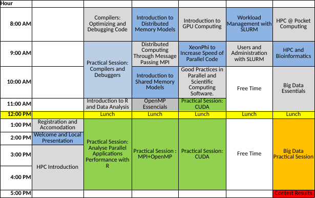

## Program

*This is a tentative program. It will be updated soon.*

### Overview

### Day 1

- Registration and Accomodation
- Welcome and Local Presentation
- HPC Introduction

### Day 2

- Compilers: Optimizing and Debugging Code
- Practical Session: Compilers and Debuggers
- Introduction to R and Data Analysis
- Practical Session: Analyse Parallel Applications Performance with R

### Day 3

- Introduction to Distributed Memory Models
- Distributed Computing Through Message Passing MPI
- Introduction to Shared Memory Models
- OpenMP Essencials
- Practical Session : MPI+OpenMP

### Day 4

- Introduction to GPU Computing
- XeonPhi to Increase Speed of Parallel Code
- Good Practices in Parallel and Scientific Computing Software.
- Practical Session: CUDA
- Practical Session: CUDA

### Day 5

- Workload Management with SLURM
- Users and Administration with SLURM

### Day 6

- HPC @ Pocket Computing
- HPC and Bioinformatics
- Big Data Essentials
- Big Data Practical Session

