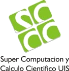

We would like to thank all the sponsors and organizers to make this possible to happen.

## Sponsors

- [**Escuela Superior de Ingeniería (ESI)**](http://esingenieria.uca.es)

{: style="text-align: center"}

## Organizers

The organizers' institutions contribute to the SC-Camp by offering their valuable time and expertise.

- [**Escuela Superior de Ingeniería (ESI)**](http://esingenieria.uca.es)

{: style="text-align: center"}

- [**University of Cadiz**](http://uca.es)

{: style="text-align: center"}

- [**University of Luxembourg**](http://uni.lu/)

{: width="150"}
{: style="text-align: center"}

- [**Universidad Industrial de Santander**](http://www.uis.edu.co/)

{: style="text-align: center"}

- [**SC3 UIS - Supercomputación y Cálculo Científico**](http://www.sc3.uis.edu.co/)

{: style="text-align: center"}

